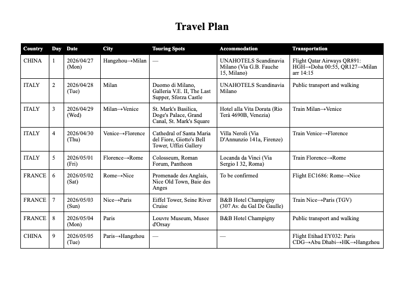
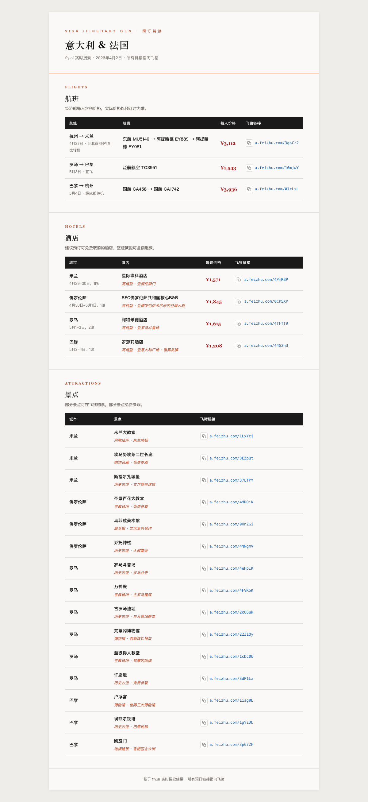
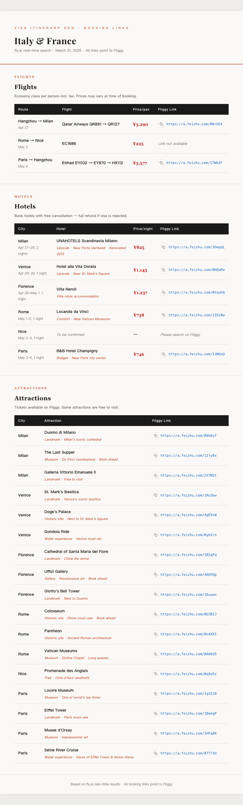

# visa-itinerary-gen

> 30秒生成领馆级签证行程计划书。真实航班+酒店+景点数据，零幻觉。

> [📋 **查看完整 PRD**](https://zephryve.github.io/visa-itinerary-gen/)

---

## 一份行程单值多少钱？¥30-110。这个 Skill 让它免费。

签证材料里，护照去出入境管理局办、银行流水去银行导、在职证明找 HR 盖章——都是"去拿"的。**只有行程计划书需要从零创作**：查航班、查酒店、查景点、算费用、排成领馆要求的全英文格式，通常 3-5 小时。

很多人不是不想 DIY 递签，而是被行程单卡住了，只好花钱找人代做：

| 携程 · 自备比代做省¥110 | 小红书 · 已售300+ | 闲鱼 · ¥50 | 闲鱼 · ¥30起 | 闲鱼 · ¥100 |
|:---:|:---:|:---:|:---:|:---:|
|  |  |  |  |  |

这个 Skill 用 AI 串联飞猪的机票、酒店、景点供给，30秒生成基于真实数据的领馆级行程单——**省 ¥30-110 代做费，省 3-5 小时手工排版，每个航班号和酒店地址签证官都能验证。**

---

## 输入一句话，输出两个产物

```
4个人4月27号从杭州去意大利和法国，5月4号回
```

| 产物 | 格式 | 说明 |
|------|------|------|
| **行程表** | PDF（单页 A4，纯英文） | 7列表格，对齐真实过签格式，打印即递签 |
| **预订链接** | HTML（中文版 + 英文版） | 航班/酒店/景点飞猪链接，一键复制，附推荐理由 |

| 行程表 PDF（[下载](assets/demo_travel_plan.pdf)） | 预订链接 · 中文版 | 预订链接 · 英文版 |
|:---:|:---:|:---:|
|  |  |  |

---

## 不是"又一个行程规划"

| | 普通行程规划 | visa-itinerary-gen |
|---|---|---|
| 受众 | 自己看 | 签证官看 |
| 语言 | 随意 | 必须全英文 |
| 精度 | 可写"自由活动" | 每天填满景点+酒店地址+交通 |
| 数据 | LLM 可编造 | flyai 真实 API，不编 |
| 输出 | Markdown | 单页 A4 PDF，打印即递签 |

**竞品空白**：ClawHub/OpenClaw 生态内零签证文书类 Skill。

---

## 安装

前置依赖：[flyai](https://github.com/alibaba-flyai/flyai-skill)

**OpenClaw：**
```bash
clawhub install visa-itinerary-gen
```

**Claude Code：**
```bash
cp -r visa-itinerary-gen ~/.claude/skills/visa-itinerary-gen
```

**一键安装所有依赖：**
```bash
bash scripts/setup.sh
```

Skill 首次运行时也会自动检查依赖，缺什么提示装什么。

---

## 技术链路

```
用户输入 → 参数解析（目的地 / 日期 / 人数）
              ↓
        并行调用 flyai
   ┌──────────┼──────────┐
search-flight  search-hotels  search-poi
   └──────────┼──────────┘
              ↓
         数据聚合 + 内置逻辑
         (申根天数校验 / 主申请国判断)
              ↓
         输出生成
   ┌──────────┴──────────┐
行程表 PDF           预订链接 HTML
(纯英文 A4)         (中文版 + 英文版)
```

### flyai 调用约束

| 命令 | 注意事项 |
|------|---------|
| `search-hotels` | 海外城市**必须带日期**，小城市需校验返回地址 |
| `search-poi` | **必须用中文城市名** |

---

## flyai 能力缺口反馈

Agentic Coding 中发现的问题：

| 缺口 | 建议 |
|------|------|
| search-hotels 不支持免费取消筛选 | 增加退改政策参数 |
| search-hotels 海外不带日期返回空 | 文档标注必填 |
| search-flight 不返回退改规则 | 增加票价规则字段 |
| search-poi 不支持英文城市名 | 支持英文查询 |
| search-hotels 小城市名歧义（Nice→泰国） | 结合地理位置过滤 |

---

## License

MIT

zephryve@gmail.com · [github.com/zephryve](https://github.com/zephryve)
